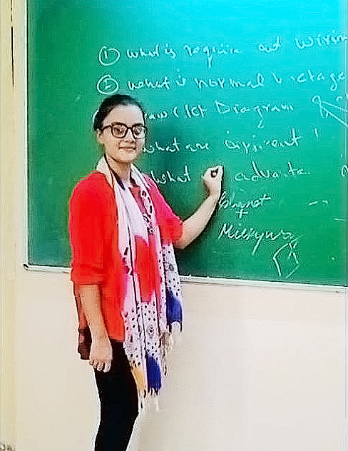

# Portfolio - Saumya Mishra

## Introduction

Welcome to my portfolio! I'm Saumya Mishra, an Electrical Engineering student with a passion for continuous learning and a solid foundation in electrical systems. This portfolio showcases my skills, qualifications, and projects. Feel free to explore!

## Table of Contents

- [Home](#home)
- [About Me](#about)
- [Skills](#skills)
- [Qualification](#qualification)
- [Contact Me](#contact)

## Home

- **Name**: Saumya Mishra
- **Title**: Electrical Engineer
- **Tagline**: An Enthusiastic and Dedicated Electrical Engineering Student

## About Me

I am an energetic and diligent Electrical Engineering student with a passion for learning and a strong foundation in electrical systems. My journey includes certifications, projects, and internships, making me well-versed in various aspects of electrical engineering.

- **Download CV**: [Saumya Mishra (Resume).pdf](assets/resume/Saumya%20Mishra%20(Resume).pdf)

## Skills

### Programming Skills

- **Python**: 60%
- **Matlab**: 80%

### Software Skills

- **MS Word**: 80%
- **MS Excel**: 80%
- **Autocad**: 70%

### Engineering Skills

- **Electrical Systems and Power Generation**: 70%
- **Substation Operations and Maintenance**: 70%
- **Troubleshooting and Repair**: 70%

## Qualification

### Education

- **B.Tech(EE)**
  - Dr. Ram Manohar Lohia Awadh University Ayodhya
  - 2020 - 2024

- **Class 12th**
  - Little Flower School, Gorakhpur
  - 2018 - 2019

- **Class 10th**
  - Little Flower School, Gorakhpur
  - 2017 - 2018

### Work Experience

- **Trainee – N.E. Railway, Gorakhpur**
  - Electrical Workshop (Vocational Training)
  - July 2023

- **Intern – UPPTCL, Gorakhpur**
  - 400K.V Substation, Transmission Division
  - July 2022

## Contact Me

Feel free to get in touch with me! You can reach out via email or connect on LinkedIn or WhatsApp.

- **Email**: msaumya915@gmail.com
- **Location**: Gorakhpur, U.P, India
- **About Me**: Electrical Engineer, Student Coordinator at [Dr.RMLAU](https://auth.geeksforgeeks.org/campus-ambassadors/)
- **Location**: Gorakhpur, U.P, India

## Socials

Connect with me on:
- [LinkedIn](https://www.linkedin.com/in/saumya-mishra-2b256a228/)
- [WhatsApp](https://wa.me/1XXXXXXXXXX?text=Hi%20Saumya!!)
- [GitHub](https://github.com/iamsaumyamishra)

## Copyright

© Saumya

Thank you for visiting! 😊
